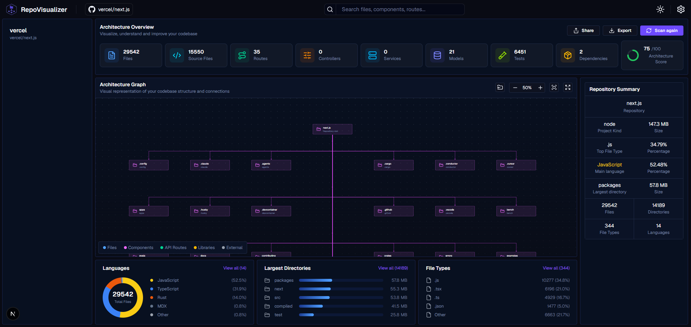
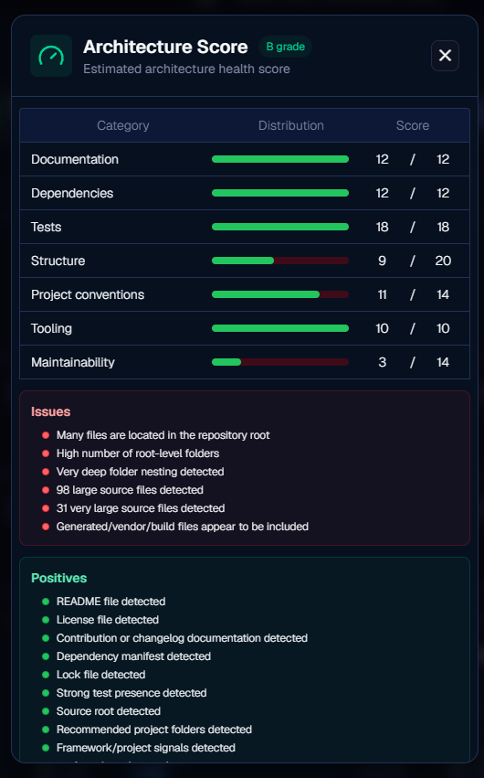
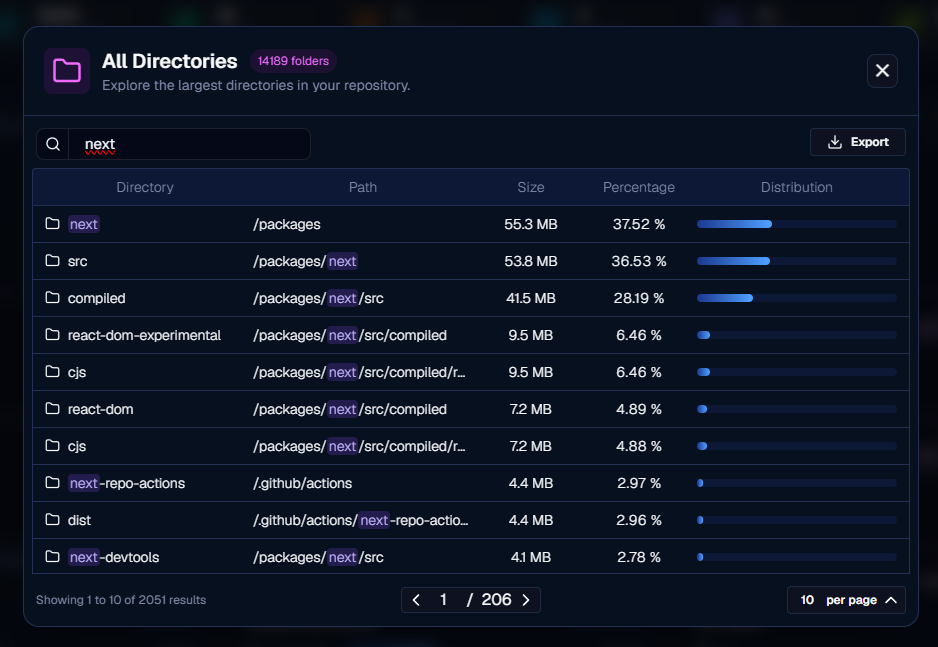

# Repo Visualizer

Web application for analyzing, visualizing and understanding GitHub repositories through an interactive graph-based interface.

Repository: https://github.com/Xeris-code/repo-visualizer

Live version: *Coming soon*

---

## About

Repo Visualizer is a developer tool built to turn a GitHub repository into a visual and structured overview.

Instead of browsing a repository only through folders and files, the application focuses on:

* repository structure visualization
* folder and file statistics
* language distribution
* project type detection
* architecture-oriented insights
* graph-based exploration

The goal is to make large codebases easier to understand at a glance.


Navigate your codebase structure!
<div classname="items-center">

</div>

Check architecture score and issues!


Search directories!


---

## Features

### Repository Analyzer

* GitHub repository URL parsing
* public repository validation
* repository tree fetching
* language data fetching
* file and folder extraction
* repository size calculation
* dominant language detection
* largest directory detection
* file type statistics

### Graph Visualization

* repository graph model
* top-level repository graph
* folder-based graph layout
* graph node positioning
* custom graph layout helpers
* React Flow based rendering
* support for switching between root and folder views

### Repository Statistics

* total files
* total directories
* repository size
* dominant language
* largest directories
* language breakdown
* file type distribution
* project kind detection
* architecture score
* architecture metrics

### Architecture Insights

The app includes logic for detecting different project types and calculating architecture-related metrics.

Supported project kinds include:

```txt
Next.js
React
Vue
Angular
Svelte
Node.js
Python
Java
.NET
Go
Rust
PHP
Ruby
Android
iOS
Polyglot
Generic
```

### UI System

* dashboard-style layout
* navigation bar
* sidebar
* main graph window
* stats panels
* reusable UI components
* dark UI focused design
* icon-based visual feedback
* modular feature-based folder structure

---

## Tech Stack

* Next.js
* React
* TypeScript
* TailwindCSS
* React Flow / XYFlow
* Lucide React
* Radix UI
* shadcn-style components
* TanStack React Query
* Zod
* Octokit
* OpenAI SDK

---

## Architecture

The application is structured around a repository analysis pipeline:

```txt
GitHub Repository URL
        ↓
URL Parser
        ↓
GitHub API
        ↓
Repository Tree + Language Data
        ↓
Repository Analyzer
        ↓
Stats Model + Graph Model
        ↓
Dashboard UI + React Flow Graph
```

Main systems:

* repository API layer
* repository parser
* repository analyzer
* statistics builders
* architecture scoring system
* graph model builder
* graph layout engine
* React Flow mapper
* app shell layout
* shared UI components

---

## Project Structure

```txt
repo-visualizer
├── app
│   ├── layout.tsx
│   ├── page.tsx
│   └── globals.css
│
├── app-shell
│   ├── components
│   ├── state
│   └── types
│
├── graph
│   ├── components
│   ├── layout
│   ├── mappers
│   ├── styles
│   └── types
│
├── insights
│   ├── components
│   └── hooks
│
├── repository
│   ├── analysis
│   ├── api
│   ├── components
│   ├── hooks
│   ├── services
│   ├── stats
│   ├── types
│   └── utils
│
├── shared
│   ├── constants
│   ├── hooks
│   ├── types
│   ├── ui
│   └── utils
│
└── public
    └── graphics
```

---

## Repository Analysis Flow

```txt
Input URL
   ↓
parseGithubRepoUrl()
   ↓
fetchRepositoryTree()
fetchRepositoryLanguages()
   ↓
analyzeRepository()
   ↓
buildRepoStats()
buildRepoGraph()
   ↓
Render stats + graph
```

The analyzer currently builds:

* repository tree
* language statistics
* directory statistics
* file type statistics
* graph model
* architecture score details
* project kind metadata

---

## Example Usage

Paste a GitHub repository URL:

```txt
https://github.com/owner/repository
```

The app analyzes the repository and generates:

```txt
Repository Summary
├── Name
├── Size
├── Total files
├── Total directories
├── Dominant language
├── Largest directory
├── File types
├── Languages
└── Architecture score
```

Graph output example:

```txt
repository
├── app
├── components
├── lib
├── public
└── shared
```

---

## Why I Built This

When opening an unfamiliar codebase, it is often hard to quickly understand:

* what kind of project it is
* how it is structured
* where the largest parts are
* which technologies dominate
* how folders relate to each other
* whether the architecture looks organized

This project was created to explore:

* codebase visualization
* GitHub API integration
* graph-based UI
* repository analysis
* frontend architecture
* TypeScript-heavy application design
* developer tooling

The long-term goal is to build a tool that can help developers understand repositories faster before reading the actual code.

---

## Current Status

This project is still in active development.

Already implemented or partially implemented:

* repository URL parser
* GitHub tree fetching
* GitHub language fetching
* repository statistics
* language statistics
* directory statistics
* file type statistics
* project kind detection
* architecture score model
* graph model generation
* top-level graph layout
* folder graph layout
* app shell layout
* shared UI system

Planned / in progress:

* repository summary panel
* node selection panel
* sidebar tree synchronization
* real dependency parser
* dependency edges
* graph search
* fullscreen graph mode
* reset button
* status indicators
* GitHub stars count
* settings menu
* light / dark mode
* AI-powered repository summary

---

## Future Improvements

* real dependency graph generation
* import/export relationship parser
* file-level graph exploration
* clickable node details
* folder tree sidebar sync
* repository search
* graph minimap improvements
* architecture recommendation system
* AI-generated repository summary
* support for private repositories
* GitHub authentication
* better error handling
* loading skeletons
* project comparison mode
* export graph as image
* shareable analysis links

---

## Local Development

```bash
git clone https://github.com/Xeris-code/repo-visualizer.git
cd repo-visualizer
npm install
npm run dev
```

Open:

```txt
http://localhost:3000
```

---

## Available Scripts

```bash
npm run dev
```

Runs the development server.

```bash
npm run build
```

Builds the application for production.

```bash
npm run start
```

Starts the production server.

```bash
npm run lint
```

Runs ESLint.

---

## Author

Peter "Xeris" Čišovský

* GitHub: https://github.com/Xeris-code
* LinkedIn: https://www.linkedin.com/in/xeris-code/
* Portfolio: https://xeris.sk
